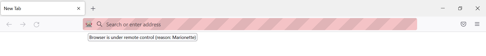

```{r setup, echo=FALSE}
knitr::opts_chunk$set(
  eval = FALSE
)
```

```{r xaringanExtra-clipboard, echo=FALSE, eval=TRUE}
htmltools::tagList(
  xaringanExtra::use_clipboard(
    button_text = "<i class=\"fa fa-clipboard\"></i>",
    success_text = "<i class=\"fa fa-check\" style=\"color: #90BE6D\"></i>",
    error_text = "<i class=\"fa fa-times-circle\" style=\"color: #F94144\"></i>"
  ),
  rmarkdown::html_dependency_font_awesome()
)
```

# Introduction


Scraping can be divided in two steps:

1. getting the HTML that contains the information
2. cleaning the HTML to extract the information we want

--

.h-1em[]

These 2 steps don't require the same tools, and .color2[*shouldn't be made at the same time*].

.h-1em[]

---

Here, we will focus on step 1: .color2[*how to get the HTML we need with dynamic webpages?*]

---

# Static vs dynamic


**Static webpage**: all the information is loaded with the page.

Example: Wikipedia.

--

.h-1em[]

**Dynamic webpage**: the website uses JavaScript to fetch data from their servers and .color2[*dynamically*] update the page. 

Example: see later.

---

class: section

# (R)Selenium

---

# Idea


Idea: control the browser from the command line.

.h-1em[]

*I wish I could click on this button to open a modal*

```{r}
remote_driver$
  findElement(using = "css", value = ".my-button")$
  clickElement()
```

.h-1em[]

*I wish I could fill these inputs to automatically connect*

```{r}
remote_driver$
  findElement(using = "id", value = "password")$
  sendKeysToElement(list("my_super_secret_password"))
```


---

Almost everything you can do "by hand" in a browser, you can reproduce with Selenium:

.column-40[
* open a browser

* click on something

* enter values

* go to previous/next page

* refresh the page

* .color1[get all the HTML that is currently displayed]

]

.column-40[
* `open()` / `navigate()`

* `clickElement()`

* `sendKeysToElement()`

* `goBack()` / `goForward()`

* `refresh()`

* .bold1[`getPageSource()`]
]

.center[. . .]

---

class: section

# Get started

---

<p>In the beginning there was <span style="text-decoration: line-through;">light</span> <code class="remark-inline-code">rsDriver()</code>: </p>

.h-1em[]

```{r}
# if not already installed
# install.packages("RSelenium")
library(RSelenium)

driver <- rsDriver(browser = "firefox") # can also be chrome
remote_driver <- driver[["client"]]
```


--

.h-1em[]

This will print a bunch of messages and open a "marionette browser".


 
---

From now on, everything we do is calling `<function>()` starting with `remote_driver$`.footnote[Or whatever you called it in the previous step].

.h-1em[]

**Objective:** get the list of core contributors to R located [here](https://www.r-project.org/contributors.html).

---

# Navigate 

```{r}
remote_driver$navigate("https://r-project.org")
```


---

# Click on "Contributors"

This requires two things:
1. find the element
2. click on it

.h-1em[]

Humans -> eyes

Computers -> HTML/CSS

---

To find the element, we need to open the console to see the structure of the page.

Several ways to do it:
* right-click -> "Inspect"
* `Ctrl` + `Shift` + `C`

.h-1em[]


 
---

Then, hover the element we're interested in: the link "Contributors".

 

---

How can we find this with `RSelenium`?

```{r}
?RSelenium::remoteDriver
```

-> `findElement`

.h-1em[]

* class name ❌
* id ❌
* name ❌
* tag name ❌


* css selector ✔️
* link text ✔️
* partial link text ✔️
* xpath ✔️

---

All of these work:
```{r}
remote_driver$
  findElement("link text", "Contributors")$
  clickElement()

remote_driver$
  findElement("partial link text", "Contributors")$
  clickElement()

remote_driver$
  findElement("xpath", "/html/body/div/div[1]/div[1]/div/div[1]/ul/li[3]/a")$
  clickElement()

remote_driver$
  findElement("css selector", "div.col-xs-6:nth-child(1) > ul:nth-child(6) > li:nth-child(3) > a:nth-child(1)")$
  clickElement()
```

---

We are now on the right page!

.h-1em[]


---

Last step: obtain the HTML of the page.

```{r}
remote_driver$getPageSource()
```
.h-1em[]
--

To read it with `rvest`:
```{r}
x <- remote_driver$getPageSource()[[1]]
rvest::read_html(x)
```

---
name: contributors-last-step

Do we read the HTML and extract the information in the same script?

--

.h-1em[]

.bold1[No!]

.h-1em[]

Rather, we save the HTML in an external file, and we will be able to access it in another script (and offline) to manipulate it as we want.footnote[Although, in this case, it wouldn't cost too much to treat it directly in the same script.].

```{r}
write(x, file = "contributors.html")
# Later and in another script
rvest::read_html("contributors.html")
```
.h-2em[]

.fs-12[Click [here](#contributors-results) to see the results.]

---

class: section

# A harder & real-life example

---

The previous example was not a *dynamic* page: we could have used the link to the page and apply webscraping methods for static webpages.

.h-1em[]

Let's now dive into a more complex example, where RSelenium is the only way to scrape.


---

# How to know when Selenium is needed?

.color2[*Using RSelenium is slower than using "classic" scraping methods*], so it's important to check all possibilities before using it.

.h-1em[]

Use Selenium if:

* the HTML you want is not directly accessible, i.e need some interactions (clicking on a button, connect to a website...)

* the URL doesn't change with the inputs

* you can't access the data directly in the "network" tab of the console


---

# Example: Sao Paulo immigration museum


ASK MARTIN FIRST


---

name: contributors-results

# Appendix

For reference, here's the code to extract the list of contributors:

.fs-16[
```{r appendix, eval=TRUE}
library(rvest)

html <- read_html("contributors.html") 

bullet_points <- html %>% 
  html_elements(css = "div.col-xs-12 > ul > li") %>% 
  html_text()

blockquote <- html %>% 
  html_elements(css = "div.col-xs-12.col-sm-7 > blockquote") %>% 
  html_text() %>% 
  strsplit(., split = ", ")

blockquote <- blockquote[[1]] %>% 
  gsub("\\r|\\n|\\.|and", "", .)

others <- html %>% 
  html_elements(xpath = "/html/body/div/div[1]/div[2]/p[5]") %>% 
  html_text() %>% 
  strsplit(., split = ", ")

others <- others[[1]] %>% 
  gsub("\\r|\\n|\\.|and", "", .)

all_contributors <- c(bullet_points, blockquote, others)
```
]

---

# Appendix

```{r appendix, eval=TRUE, echo = FALSE}
```

.fs-9[
```{r eval=TRUE, echo = FALSE}
all_contributors[1:136] 
```
]

.fs-13[[Back](#contributors-last-step)]
